# EasyTodo
```
                               __              _____          _       
                              /__\_ _ ___ _   /__   \___   __| | ___  
                             /_\/ _` / __| | | |/ /\/ _ \ / _` |/ _ \ 
                            //_| (_| \__ \ |_| / / | (_) | (_| | (_) |
                            \__/\__,_|___/\__, \/   \___/ \__,_|\___/ 
                                          |___/     
```

- 本软件是一款**待办事项软件**，能够方便有效地管理代办事项，遵循极简的设计风格。

### 目录
- [开发者](#user-content-开发者)
- [技术](#user-content-技术)
- [引用库](#user-content-引用库)
- [已实现的功能](#user-content-已实现的功能)
    + [启动画面](#user-content-启动画面)
    + [主界面](#user-content-主界面)
    + [详情页](#user-content-详情页)
    + [设置页面](#user-content-设置页面)
    + [菜单](#user-content-菜单)
    + [已完成列表](#user-content-已完成列表)
- [待解决事项](#user-content-待解决事项)
    + [待添加功能](#user-content-待添加功能)
    + [待优化](#user-content-待优化)
- [历史](#user-content-历史)


### 开发者
***15软工三人组开发***

- Wendy -> *[Wendy](https://github.com/wendyltan)*
- Sdite -> *[Sdite](https://github.com/VonSdite)*
- Mxin -> *[Mxin](https://github.com/JnuMxin)*


### 技术

- Material design（材料化设计）
- LitePal database（数据库）
- Image capture and store（调用摄像头，以及照片保存）

### 引用库

- [LitePal](https://github.com/LitePalFramework/LitePal)
- [SwipeRecyclerView](https://github.com/yanzhenjie/SwipeRecyclerView)
- [PermissionGen](https://github.com/lovedise/PermissionGen)
- [MaterialDrawer](https://github.com/mikepenz/MaterialDrawer)
- RecyclerView
- [Glide](https://github.com/bumptech/glide)

### 已实现的功能

#### 启动画面


#### 主界面

- 添加待办事件项目

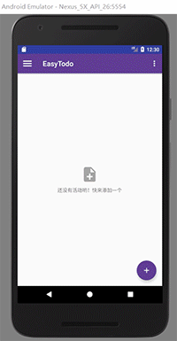


- 移动事件项目的功能

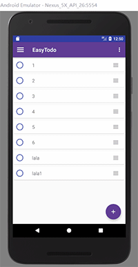


- 打钩删除（已完成事件）的功能

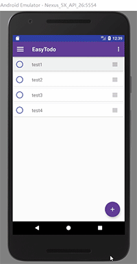


- 点击事件项目进入编辑

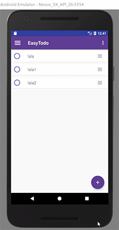


- 事件左侧滑动菜单(分别是编辑，分享，删除菜单)

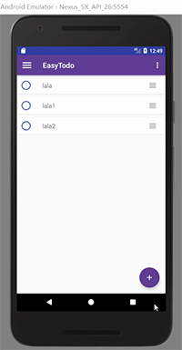  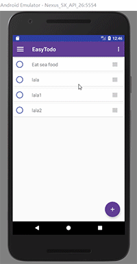


#### 详情页
- 修改截止日期
- 修改提醒时间
- 修改事件所属类别
- 图片附加

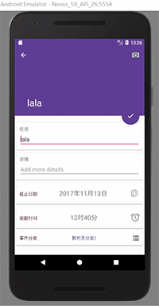 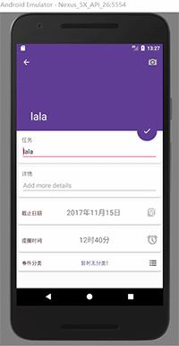 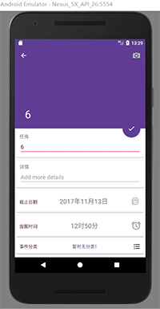  


#### 设置页面
- 设置软件的用户名


- 更改主题颜色

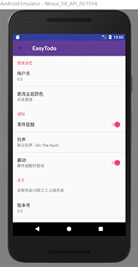
- 开启或关闭事件提醒（开启应用时候的提醒）
- 选择提醒的铃声
- 选择是否震动
- 问题反馈功能

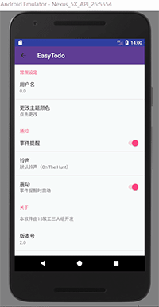 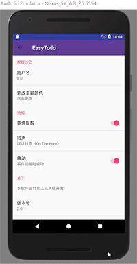 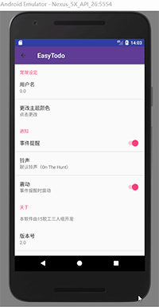 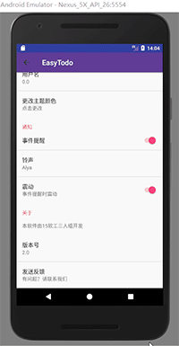 


#### 菜单
- 将过期的事件推迟到明天的功能
- 删除全部事件的功能（非完成性删除）

 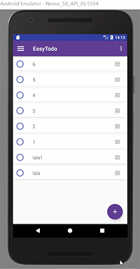

#### 已完成列表
- 已完成的事件

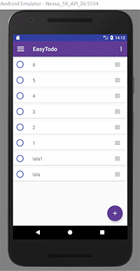


### 待解决事项
*以下为后续项目需解决的事项*

#### 待添加功能
- ~~可添加子任务的功能~~(not consider)
- ~~添加长期任务/定期提醒任务~~(not consider)
- 闹钟提醒功能
- 点击附加的图片查看大图的功能
+ ~~添加分类事件界面的功能~~(done)
- 获取课表，上课前提醒
- 加入类似聊天机器人的客服，后续可更改为智能机器人，自动为用户生成相应事项

#### 待优化
- 点击完成事件的方式
- 修复app中存在的小bug
- 使用Butterknife代替findViewById简化代码
- 整合优化代码（去掉多余的东西）


### 历史

- **17/12/01**
    + 将推迟到明天改回推迟到今天
    + 设置新添加的任务默认闹钟为空，即闹钟那里默认不显示时间，后续需要做开启和关闭闹钟的功能

- **17/11/28**
    + 修改软键盘问题，主页通知问题，生成2.0版本的release

- **17/11/15**
    + 侧边栏彻底更改为Material Drawer

- **17/11/12**
    + 加入了Expandlistview用于事件分类

- **17/11/6**
    + 隐藏了浏览器入口，回复首页提醒功能
    
- **17/11/1**
    + 修改回到最初对完成事项的操作方式

- **17/10/31**
    + 修改滑动菜单的bug
    + 允许整个item可以拖动
    + 解决拖动item时 没有关闭contextmenu的问题
    + 修改了点击完成事件的情况， 当你点击时会打钩，切换掉界面回来时这个事件会被加入到finishEvent
    + 添加打包demo.apk ! [demo](/demo/demo-17-10-31.apk)

- **17/10/30**
    + 设置toolbar为透明的颜色， 避免遮挡图片
    + 修缮数据库
    + 解决日期过期显示问题
    + 将推迟到今天修改为推迟到明天
    + 解决某些逻辑问题
    + 解决拖动交换卡顿的问题
    + **Calendar**对象不能直接保存到数据库！！！
    + 修改了TimePicker为24小时制
    + 改变了包名。原来的包名最后的"myapplication"可能会与其他软件冲突


- **17/10/29**
    + 保留安卓长按删除的菜单
    + 更改分享的图标
    + 解决拖动后没有更新到数据库的问题(给数据库加多一个pos属性，每次移动后更改pos，Item显示的时候根据pos的顺序来显示即可)
    + 删除多余的代码， 并整合修改代码，小整理
    + 搞定部分小细节的bug， 比如修改事件的名称判空，限制一行等问题

- **17/10/28**
    + 10/26做的事件滑动删除由于无法用ItemTouchHelper来实现滑动菜单，前功尽弃，**抛弃了该方法**
    + 采用外援库[**SwipeRecyclerView**](https://github.com/yanzhenjie/SwipeRecyclerView)实现事件项的拖拽交换， 滑动菜单

- **17/10/26**
    + 添加事件的EditText 禁止换行，且对软键盘的确定按钮进行响应，并判断EditText内容是否为空
    + 完成事件项 的拖动交换， 滑动删除的功能

- **17/10/25**
    + 修改添加事件的button的响应，使其点击时隐藏，添加完按钮后显示
    + OptionMenu中的全部删除的点击事件加入AlertDialog，防止用户错误点击致使所有事件被删除
    + 添加事件时EditText会获取焦点并自动弹出键盘

- **17/10/25前** 
    + 完成EasyTodo所有基本功能